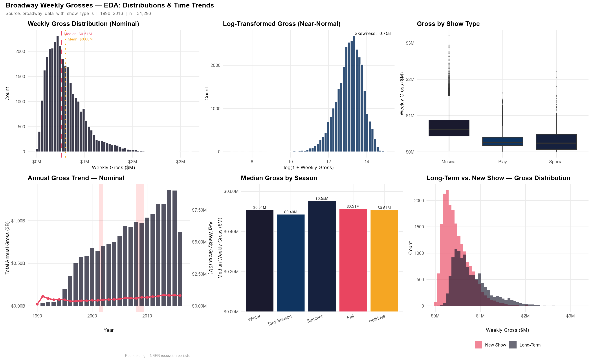
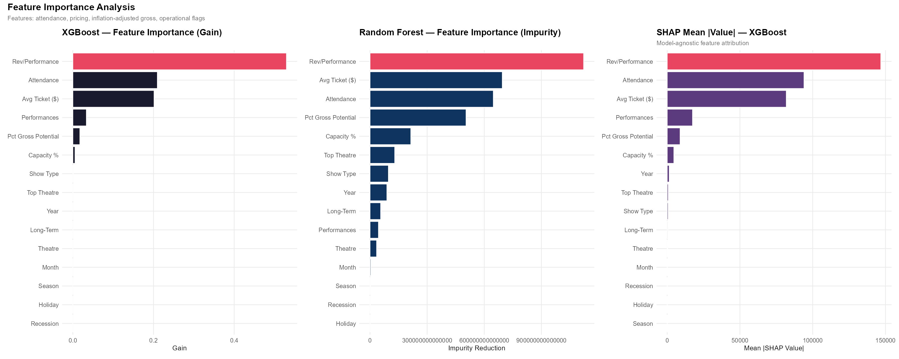
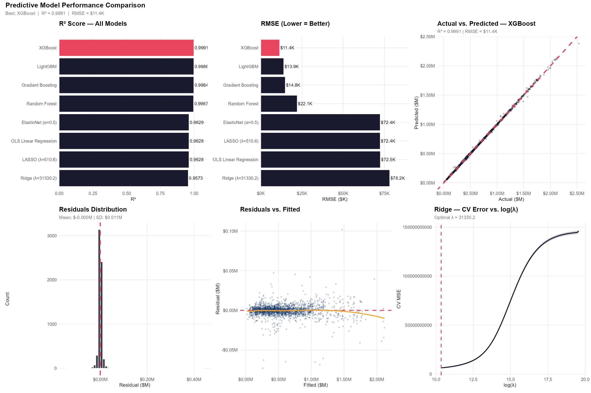

[README-Broadway-Weekly-Grosses.md](https://github.com/user-attachments/files/30099491/README-Broadway-Weekly-Grosses.md)

# Predicting Broadway Weekly Grosses — A Multi-Model Ensemble

> Predictive Analytics (MAR664) · Pace University, Lubin School of Business · team project

Predicts a Broadway show's **weekly gross revenue** from pricing, attendance, and show-level features, using an **XGBoost / LightGBM / Random Forest ensemble** with PCA and k-fold cross-validation in R.

---

## Business question
Can we predict a show's weekly gross — and identify which factors drive it — from pricing, run length, attendance, and other performance signals?

## Data
Multi-season Broadway weekly grosses with pricing, attendance, and show-level attributes, cleaned and feature-engineered before modeling.

## Approach
1. **EDA & feature engineering** — distributions, time trends, inflation adjustment, and relationship analysis
2. **Dimensionality reduction** — PCA to compress correlated predictors
3. **Ensemble modeling** — XGBoost, LightGBM, and Random Forest combined
4. **Validation** — k-fold cross-validation for out-of-sample performance
5. **Interpretation** — model comparison and feature-importance analysis

Code: `MAR664_Group1_Broadway_Analysis.R` (core) and `MAR664_Group1_Broadway_Enhanced.R` (extended).

## Selected results

**Exploratory trends**

**What drives weekly gross — feature importance**

**Model comparison**

- The ensemble outperformed the individual baseline models on cross-validated error.
- Feature-importance analysis surfaced the strongest drivers of weekly gross, giving the model interpretability alongside accuracy.

## Repository contents
| File | What it is |
|------|------------|
| `MAR664_Group1_Broadway_Analysis.R` | Core analysis and modeling pipeline |
| `MAR664_Group1_Broadway_Enhanced.R` | Extended / enhanced modeling |
| `fig1_distributions_time_trends.png` … `fig7_regression_coefficients.png` | EDA and result figures |

## Tools
**R** — XGBoost, LightGBM, Random Forest, PCA, k-fold cross-validation

## Note
Course team project for MAR664 (Predictive Analytics).

## Author
**Eisenhower Agyekum-Yamoah** — MBA, Business Analytics &amp; Finance (Pace University, Lubin School of Business)
[LinkedIn](https://www.linkedin.com/in/eisenhower-agyekum-yamoah) · [Tableau Public](https://public.tableau.com/app/profile/eisenhower.agyekum.yamoah)
